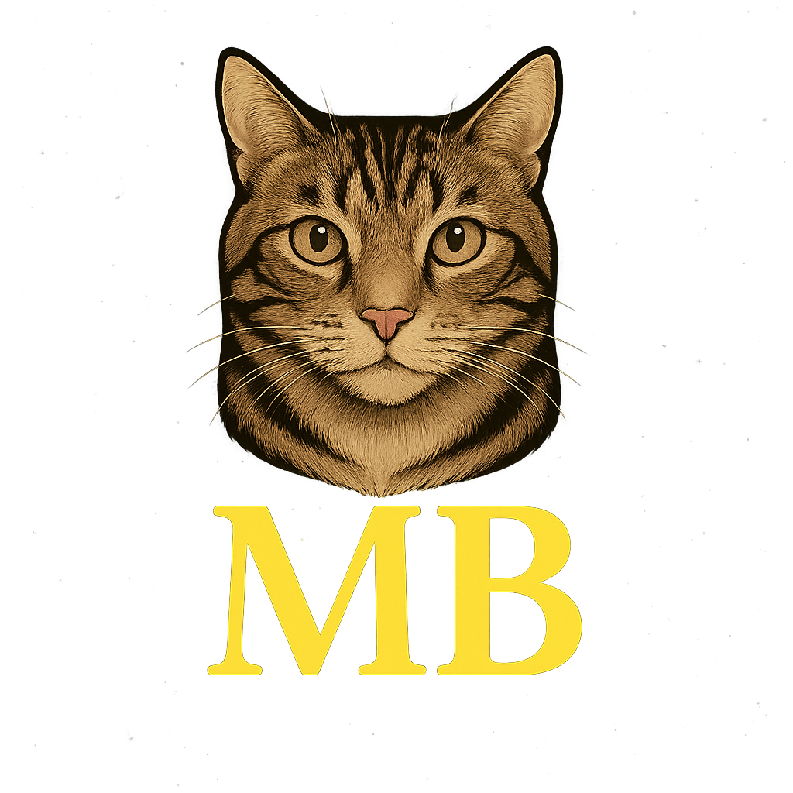
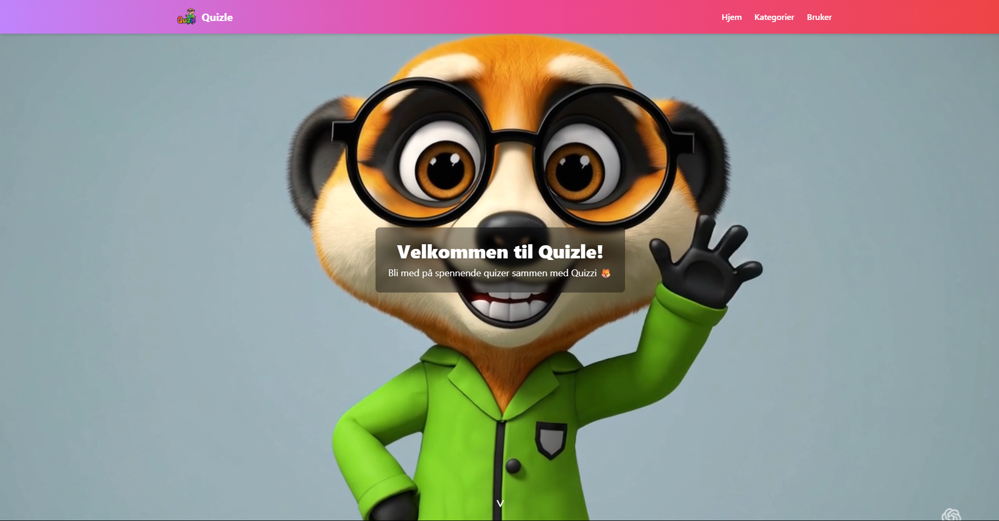

<p align="center">
  
</p>

# 🎉 Quizle – Lær og lek med Quizzi!

Velkommen til **Quizle** – en fargerik og interaktiv quiz-app utviklet for barn og unge. Her kan du lære om matte, historie, geografi og dyr (flere kommer!), guidet av maskoten **Quizzi** 🦊

---

## 🌈 Hva er dette prosjektet?

Dette prosjektet er laget som en del av en læringsreise i frontend-utvikling med Vue. Målet er å lage en engasjerende og brukervennlig plattform for læring gjennom spill.

---

## 🚀 Kom i gang

### 1. Klon prosjektet

```bash
git clone https://github.com/ditt-brukernavn/quizle.git
cd quizle
```

### 2. Installer avhengigheter

```bash
npm install
```

### 3. Start utviklingsserver

```bash
npm run dev
```

---

## 🛠️ Teknologier brukt

- **Vue 3** + `<script setup>`
- **Vite** – rask utviklingsserver
- **Tailwind CSS** – for moderne styling
- **Vue Router** – for navigasjon
- **Pinia** (valgfritt) – for state management
- **Custom komponentstruktur** – lett å vedlikeholde og utvide

---

## 🗂️ Prosjektstruktur

```
quizle/
├── public/             # Offentlige filer (logo, bilder)
├── src/                # Kildekode
│   ├── assets/         # Bilder, ikoner, videoer
│   ├── components/     # Gjenbrukbare UI-komponenter
│   ├── views/          # Sider som HomeView, CategoryView
│   ├── router/         # Navigasjon (Vue Router)
│   └── App.vue         # Root-komponent
├── index.html          # HTML-mal
├── package.json        # Avhengigheter og scripts
└── vite.config.js      # Vite-konfigurasjon
```

---

## 📸 Eksempel på nettsiden

<p align="center">
  
</p>

---

## 🔧 Videre utvikling

Planlagte forbedringer:

- Brukerinnlogging og poengsystem
- Resultatside med poeng og medaljer
- Flere quiz-kategorier
- Flerspråklig støtte (norsk/engelsk)

---

## ✍️ Signatur

```
//  One bug to find them,
//  One fix to bring them all,
//  And in the darkness bind them.
```

---

## 📬 Kontakt

Har du forslag, ideer eller ønsker å bidra? Åpne en issue eller send inn en pull request via GitHub!

---
